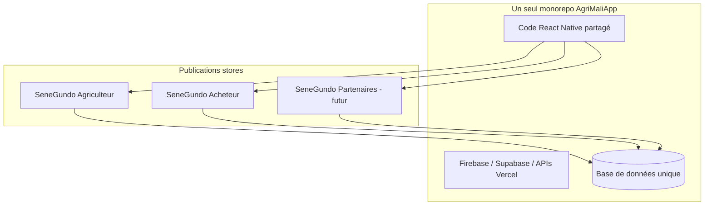

# SeneGundo

**La donnée avant la charrue.**

Plateforme mobile (React Native / Expo, TypeScript) pour l’agriculture au Mali. SeneGundo relie **producteurs**, **acheteurs** et **investisseurs / grands partenaires** autour d’une même base de données, avec des expériences adaptées à chaque profil.

---

## Vision produit

SeneGundo n’est pas « une app pour tout le monde identique » : c’est **un seul produit technique** (code + base de données) décliné en **plusieurs applications publiées** selon le rôle, afin que chaque utilisateur ne voie que ce qui le concerne.

| Profil | Qui c’est | Objectif principal |
|--------|-----------|-------------------|
| **Agriculteur** | Producteur, coopérative, exploitant | Diagnostiquer ses parcelles, suivre ses saisons, vendre sa récolte directement dans l’app |
| **Acheteur** | Consommateur, détaillant, acheteur d’intrants | Parcourir et acheter les produits mis en vente par les agriculteurs (sans les outils producteur) |
| **Investisseur / partenaire** | Grandes enseignes, grossistes, acheteurs volume | Mettre en relation des agriculteurs qui veulent écouler **rapidement de gros volumes** avec des partenaires commerciaux (y compris hors produits strictement agricoles selon les accords) |

Les trois cibles coexistent dans la **même vision** ; le déploiement et l’UI sont **filtrés par rôle**, pas par trois codebases séparées.

---

## Stratégie : une base, plusieurs apps en vitrine



**Principe** : ne pas maintenir deux applications indépendantes, mais **builder et publier deux fois** (puis trois pour les investisseurs) la même app en changeant :

- le **variante de build** (ex. variable d’environnement `APP_VARIANT=agriculteur` | `acheteur` | `partenaire`) ;
- le **bundle ID / package name** (ex. `com.senegundo.agriculteur` vs `com.senegundo.acheteur`) ;
- le **nom affiché**, l’icône et les **écrans / onglets visibles** selon le rôle autorisé à l’inscription.

Tous les comptes partagent la **même base** ; les règles d’accès (Firestore, navigation, menus) masquent les sections non pertinentes.

---

## Phase actuelle vs roadmap

### Aujourd’hui — priorité **agriculteur**

L’expérience complète est orientée **producteur** :

- Diagnostic parcelle (sol, climat, score d’aptitude)
- Rapport terrain, export PDF, cache **hors ligne**
- Historique parcelle (**saison N vs N-1**)
- Météo, diagnostic maladie par photo
- Marketplace : **mise en vente** (rôle `agriculteur` / `administrateur`)
- Académie (formation + publication de guides pour vendeurs)

C’est la version que vous développez et testez en premier (`com.senegundo.app`).

### Prochaine étape — app **acheteur**

Même code, build **acheteur** :

- **Visible** : catalogue marketplace, fiche produit, panier, commandes, profil, contenus académie achetés
- **Masqué** : carte diagnostic, configuration parcelle, rapport terrain, historique parcelle, FAB diagnostic plante, création de produit / guide

L’agriculteur publie ; l’acheteur **ne voit que ce qu’il peut acheter** (et son parcours d’achat).

### Ensuite — **investisseurs / partenaires**

Même base, variante **partenaire** (à préciser produit) :

- Mise en relation **volume** : agriculteurs qui veulent vendre vite de grandes quantités
- Partenariats avec **grandes enseignes** ou distributeurs (catalogue élargi possible au-delà du strict agricole selon les contrats)
- Flux distinct de la simple marketplace grand public (négociation, lots, statuts de partenariat — à concevoir dans le schéma données)

---

## Matrice fonctionnalités × profil

| Fonctionnalité | Agriculteur | Acheteur | Investisseur / partenaire |
|----------------|:-----------:|:--------:|:-------------------------:|
| Diagnostic parcelle (carte, rapport) | Oui | Non | Non |
| Historique parcelle & offline | Oui | Non | Non |
| Diagnostic maladie (photo) | Oui | Non | Non |
| Météo détaillée | Oui | Optionnel | Non |
| Vendre sur le marché | Oui | Non | Via partenariat B2B |
| Acheter sur le marché | Oui | **Oui** | **Oui** (volume) |
| Académie (achat) | Oui | Oui | Optionnel |
| Académie (publier) | Oui (producteur) | Non | Non |
| Partenariats / gros volumes | Non | Non | **Oui** (prévu) |

---

## Rôles techniques (code actuel)

Définis dans [`src/models/User.ts`](src/models/User.ts) et [`src/constants/userRoles.ts`](src/constants/userRoles.ts) :

| Rôle Firestore | Usage prévu | Variante d’app cible |
|----------------|-------------|----------------------|
| `agriculteur` | Producteur, vente + diagnostic | **SeneGundo Agriculteur** |
| `utilisateur` | Acheteur / apprenant sans outils champ | **SeneGundo Acheteur** |
| `administrateur` | Équipe SeneGundo | Toutes variantes (back-office) |
| `investisseur` *(à ajouter)* | Partenaires B2B | **SeneGundo Partenaires** *(futur)* |

À terme : inscription et connexion sur chaque variante d’app n’acceptent que les rôles autorisés pour ce build (ex. l’app Acheteur n’inscrit que des `utilisateur`).

---

## Modèle économique (rappel)

- **Diagnostic** : rapport parcelle (ex. 5 000 FCFA)
- **Marketplace** : commission sur les ventes producteur → acheteur
- **Académie** : vente de guides / abonnement
- **Partenariats B2B** : modèle à définir (prise de relation volume, abonnement partenaire)

---

## Démarrage rapide (développement)

### Prérequis

- Node.js 20.19.4+
- npm ou yarn
- Expo CLI (`npx expo`)
- iOS : Xcode (macOS) · Android : Android Studio

### Installation

```bash
npm install
cp .env.example .env   # Firebase, Maps, APIs — voir .env.example
```

### Lancer l’app **agriculteur** (défaut)

```bash
npm start
# ou explicitement :
npm run start:agriculteur
npm run ios
```

Dans `.env` : `APP_VARIANT=agriculteur` (ou laisser vide).

### Lancer l’app **client / acheteur** (`src/client/`)

Même projet, navigation différente (`BuyerAppNavigator`).

**Option A — scripts npm (recommandé)** — la variante est lue via `app.config.js` (pas seulement `.env`) :

```bash
npm run start:client
npm run ios:client      # simulateur iOS
npm run android:client
```

**Option B — variable dans `.env`** (si vous utilisez `npm start` sans script dédié) :

```env
APP_VARIANT=acheteur
```

Après tout changement de variante, redémarrer Metro **avec cache vidé** :

```bash
npx expo start --clear
```

**Vérification** : l’app client doit afficher **SeneGundo Marché**, 3 onglets (Accueil · Marché · Profil), **sans** barre pilule verte agriculteur ni bouton caméra central.

**Option C — une seule commande (macOS / Linux)** :

```bash
APP_VARIANT=acheteur npx expo start --clear
```

L’app acheteur affiche : Accueil marché · Onglet Marché · Profil (sans diagnostic, sans FAB caméra, sans bouton « publier un produit »).

Code : [`src/config/appVariant.ts`](src/config/appVariant.ts), navigation [`src/client/navigation/`](src/client/navigation/).

---

## Fonctionnalités détaillées (agriculteur — build actuel)

### Diagnostic agricole
- Sol (iSDA / SoilGrids), climat 5 ans (NASA POWER), score d’aptitude 0–10
- Cultures : oignon, tomate, maïs, riz, arachide, etc.
- Rapport PDF (API Vercel)

### Rétention parcelle
- Cache offline du dernier rapport et des recommandations
- Historique par lieu, comparaison **saison N vs N-1**

### Marketplace
- Vente directe par l’agriculteur, badge « certifié diagnostic »
- Panier, commandes (acheteur côté autre variante d’app)

### Académie
- Guides PDF / vidéo, achats et ventes selon le rôle

### Santé des cultures
- Photo → identification maladie (Pl@ntNet via proxy)

---

## Structure du projet

```
AgriMaliApp/
├── src/
│   ├── models/           # User, Diagnostic, Product, ParcelHistory…
│   ├── constants/        # plantes, rôles, marketplace
│   ├── config/           # Firebase, variantes (futur)
│   ├── components/
│   ├── hooks/
│   ├── navigation/       # Stack + TabBar (filtrage futur par APP_VARIANT)
│   ├── screens/
│   ├── services/         # agronomie, offline, Firebase, APIs
│   └── theme/
├── app.json              # Identifiants store (à dupliquer par variante)
├── IMPLEMENTATION_PLAN.md
└── ARCHITECTURE.md
```

---

## APIs & backend

| Service | Usage |
|---------|--------|
| ISRIC SoilGrids / iSDA | Sol |
| NASA POWER | Climat |
| OpenWeather | Météo |
| Firebase | Auth, Firestore, Storage |
| Supabase | Données complémentaires (selon modules) |
| Vercel | PDF, cultures, Pl@ntNet |

---

## Scripts npm

| Commande | Description |
|----------|-------------|
| `npm start` | Serveur Expo |
| `npm run ios` / `android` | Build natif local |
| `npm run api:dev` | API Vercel locale |
| `npm test` | Tests Jest |

---

## Documentation complémentaire

- [Plan d’implémentation](./IMPLEMENTATION_PLAN.md)
- [Architecture technique](./ARCHITECTURE.md)

---

## Contribution

1. Branche feature → commit → pull request  
2. `npm run lint` avant commit  
3. Toute nouvelle fonctionnalité doit préciser **pour quelle variante** (agriculteur / acheteur / partenaire) elle est visible.

---

## Licence

Projet privé.

---

**SeneGundo** — une plateforme, trois publics, des apps ciblées : les agriculteurs produisent et vendent ; les acheteurs achètent simplement ; les partenaires structurent les volumes et les accords commerciaux.
